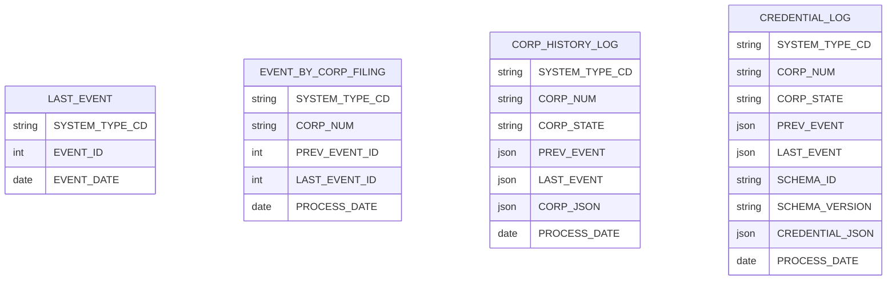

# VON Event Processor

Note that this document is not up-to-date with the latest data processing logic, however it provides a high-level overview of the overall process.

Links to the current code have been added to the doc - if you are interested in the most up-to-date documentation and logic, please look at the code.

## Event Processor Overview

The VON Event Processor connects enterprise data sources to a Sovrin edge agent, monitoring the enterprise data source(s) for changes to enterprise data, and generating credential requests that are sent to the network, using a von-x connector.

The Event processor consists of:

* A framework for running batch processes, and recording and displaying batch status (based on the Mara framework - https://github.com/mara/mara-example-project)
* A batch scheduler, to automate the processing of the above interfaces (based on go-crond - https://github.com/webdevops/go-crond)
* An optional JSON mapper, to support a configuration-based approach for generating output credentials (based on JSONbender - https://github.com/Onyo/jsonbender)
* An output processor, that sends generated credentials to a configured REST endpoint
* A local database, for tracking input events processed and output credentials generated
* A local in-memory cache, to improve performance loading and processing BC Registries corporations
* An admin interface (based on Mara), for monitoring the overall processing status

## Event Processor Data Model

The following data model is used within the Event Processor to track data that has been processed from source database(s).

The following requirements are supported:

* Publish a sub-set of Event/Filing Types in the initial release, however support inclusion of additional Types in later releases
* Support publishing of specific companies or corporations
* Support re-start if the processing fails (re-start from the point of failure)
* Support for administrative functions (update of configuration, monitoring of event processing)

The Event Processor data model is illustrated as follows:

Table descriptions are as follows:

Table LAST_EVENT: tracks the latest processed Event - a record is added for each batch of Events processed:

| Column         | Description |
| ------         | ----------- |
| RECORD_ID      | Internal database record ID |
| SYSTEM_TYPE_CD | Source system identifier (to allow the Event Processor to source data from multiple systems) |
| EVENT_ID       | ID of last event (from source system) |
| EVENT_DATE     | Date of the event (from source system) |
| ENTRY_DATE     | Date the event was processed (added to Event Processor DB) |

Table EVENT_BY_CORP_FILING: tracks the company processed for each Event batch:

| Column          | Description |
| ------          | ----------- |
| RECORD_ID       | Internal database record ID |
| SYSTEM_TYPE_CD  | Source system identifier (to allow the Event Processor to source data from multiple systems) |
| CORP_NUM        | Corporation number relating to this event |
| PREV_EVENT_ID   | Previous event id processed for this company |
| PREV_EVENT_DATE | Previous event date processed for this company |
| LAST_EVENT_ID   | Newest event id processed for this company |
| LAST_EVENT_DATE | Newest event date processed for this company |
| ENTRY_DATE      | Date this record was added to Event Processor DB |
| PROCESS_DATE    | Date this record was processed |
| PROCESS_SUCCESS | "Y" if the processing was successful, "N" if error, "S" if skipped (company type out of scope etc) |
| PROCESS_MSG     | Details about record processing (error messge, reason record was skipped, etc) |

Table CORP_HISTORY_LOG: data is loaded for each company prior to generating credentials:

| Column          | Description |
| ------          | ----------- |
| RECORD_ID       | Internal database record ID |
| SYSTEM_TYPE_CD  | Source system identifier (to allow the Event Processor to source data from multiple systems) |
| CORP_NUM        | Corporation number relating to this event |
| CORP_STATE      | Latest company state, ACTive or HIStorical |
| PREV_EVENT      | Previous event processed for this company |
| LAST_EVENT      | Newest event processed for this company |
| CORP_JSON       | Data loaded from source system in json format |
| ENTRY_DATE      | Date this record was added to Event Processor DB |
| PROCESS_DATE    | Date this record was processed |
| PROCESS_SUCCESS | "Y" if the processing was successful, "N" if error, "S" if skipped (company type out of scope etc) |
| PROCESS_MSG     | Details about record processing (error messge, reason record was skipped, etc) |

Table CREDENTIAL_LOG: generated output credentials generated

| Column          | Description |
| ------          | ----------- |
| RECORD_ID       | Internal database record ID |
| SYSTEM_TYPE_CD  | Source system identifier (to allow the Event Processor to source data from multiple systems) |
| CORP_NUM        | Corporation number relating to this event |
| CORP_STATE      | Latest company state, ACTive or HIStorical |
| PREV_EVENT      | Previous event processed for this company |
| LAST_EVENT      | Newest event processed for this company |
| CREDENTIAL_TYPE_CD | Identifies credential type |
| CREDENTIAL_ID   | To uniquely identify the credential within this table |
| SCHEMA_ID       | Schema name for this credential |
| SCHEMA_VERSION  | Schema version for this credential |
| CREDENTIAL_JSON | Json contents of the credential |
| CREDENTIAL_HASH | A unique hash of the credential json, used to prevent duplicates |
| ENTRY_DATE      | Date this record was added to Event Processor DB |
| END_DATE        | (I don't think this column is used) |
| PROCESS_DATE    | Date this record was processed |
| PROCESS_SUCCESS | "Y" if the processing was successful, "N" if error, "S" if skipped (company type out of scope etc) |
| PROCESS_MSG     | Details about record processing (error messge, reason record was skipped, etc) |

There are other tables in the Event Processor DB, but they are no longer used.

## Event Processing Description

The Event Processing will execute the following steps:

* For each supported Source System:
    * Find last Event ID processed from the (source system) table
    * Select all events with greater or equal Event ID
    * For each event:
         * Get corporation number from event
         * Add record to EVENT_BY_CORP_FILING to put in processing backlog

* For each record in backlog (EVENT_BY_CORP_FILING)
         * Load all corporation data from source system
         * Add record to CORP_HISTORY_LOG table

* For each record in the CORP_HISTORY_LOG:
    * Determine credential(s) to post, based on from/to event
    * Construct credential(s)
    * Add record(s) to CREDENTIAL_LOG table

To send credentials to Aries VCR via aca-py:

* For each unprocessed credential in CREDENTIAL_LOG:
    * Read credential data and post to the Issue Credential endpoint

