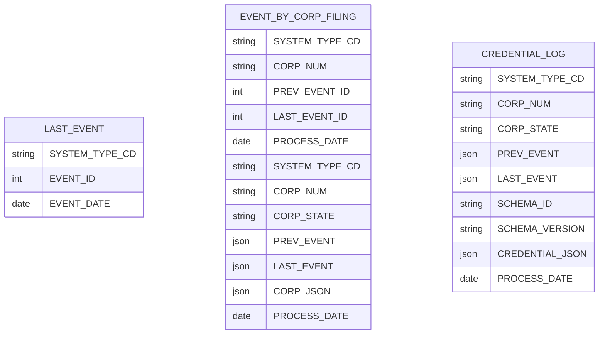

# VON Event Processor

Note that this document is not up-to-date with the latest data processing logic, however it provides a high-level overview of the overall process.

Links to the current code have been added to the doc - if you are interested in the most up-to-date documentation and logic, please look at the code.

## Event Processor Overview

The VON Event Processor connects enterprise data sources to a Sovrin edge agent, monitoring the enterprise data source(s) for changes to enterprise data, and generating credential requests that are sent to the network, using a von-x connector.


The Event processor consists of:

* A framework for running batch processes, and recording and displaying batch status (based on the Mara framework - https://github.com/mara/mara-example-project)
* A batch scheduler, to automate the processing of the above interfaces (based on go-crond - https://github.com/webdevops/go-crond)
* An optional JSON mapper, to support a configuration-based approach for generating output credentials (based on JSONbender - https://github.com/Onyo/jsonbender)
* An output processor, that sends generated credentials to a configured REST endpoint
* A local database, for tracking input events processed and output credentials generated
* A local in-memory cache, to improve performance loading and processing BC Registries corporations
* An admin interface (based on Mara), for monitoring the overall processing status

## Event Processor Data Model

The following data model is used within the Event Processor to track data that has been processed from source database(s).

The following requirements are supported:

* Publish a sub-set of Event/Filing Types in the initial release, however support inclusion of additional Types in later releases
* Support publishing of specific companies or corporations
* Support re-start if the processing fails (re-start from the point of failure)
* Support for administrative functions (update of configuration, monitoring of event processing)

The Event Processor data model is illustrated as follows:



Table descriptions are as follows:

Table LAST_EVENT: tracks the latest processed Event - a record is added for each batch of Events processed:

| Column         | Description |
| ------         | ----------- |
| RECORD_ID      | Internal database record ID |
| SYSTEM_TYPE_CD | Source system identifier (to allow the Event Processor to source data from multiple systems) |
| EVENT_ID       | ID of last event (from source system) |
| EVENT_DATE     | Date of the event (from source system) |
| ENTRY_DATE     | Date the event was processed (added to Event Processor DB) |

Table EVENT_BY_CORP_FILING: tracks the company processed for each Event batch:

| Column          | Description |
| ------          | ----------- |
| RECORD_ID       | Internal database record ID |
| SYSTEM_TYPE_CD  | Source system identifier (to allow the Event Processor to source data from multiple systems) |
| CORP_NUM        | Corporation number relating to this event |
| PREV_EVENT_ID   | Previous event id processed for this company |
| PREV_EVENT_DATE | Previous event date processed for this company |
| LAST_EVENT_ID   | Newest event id processed for this company |
| LAST_EVENT_DATE | Newest event date processed for this company |
| ENTRY_DATE      | Date this record was added to Event Processor DB |
| PROCESS_DATE    | Date this record was processed |
| PROCESS_SUCCESS | "Y" if the processing was successful, "N" if error, "S" if skipped (company type out of scope etc) |
| PROCESS_MSG     | Details about record processing (error messge, reason record was skipped, etc) |

Table CORP_HISTORY_LOG: data is loaded for each company prior to generating credentials:

| Column          | Description |
| ------          | ----------- |
| RECORD_ID       | Internal database record ID |
| SYSTEM_TYPE_CD  | Source system identifier (to allow the Event Processor to source data from multiple systems) |
| CORP_NUM        | Corporation number relating to this event |
| CORP_STATE      | Latest company state, ACTive or HIStorical |
| PREV_EVENT      | Previous event processed for this company |
| LAST_EVENT      | Newest event processed for this company |
| CORP_JSON       | Data loaded from source system in json format |
| ENTRY_DATE      | Date this record was added to Event Processor DB |
| PROCESS_DATE    | Date this record was processed |
| PROCESS_SUCCESS | "Y" if the processing was successful, "N" if error, "S" if skipped (company type out of scope etc) |
| PROCESS_MSG     | Details about record processing (error messge, reason record was skipped, etc) |

Table CREDENTIAL_LOG: generated output credentials generated

| Column          | Description |
| ------          | ----------- |
| RECORD_ID       | Internal database record ID |
| SYSTEM_TYPE_CD  | Source system identifier (to allow the Event Processor to source data from multiple systems) |
| CORP_NUM        | Corporation number relating to this event |
| CORP_STATE      | Latest company state, ACTive or HIStorical |
| PREV_EVENT      | Previous event processed for this company |
| LAST_EVENT      | Newest event processed for this company |
| CREDENTIAL_TYPE_CD | Identifies credential type |
| CREDENTIAL_ID   | To uniquely identify the credential within this table |
| SCHEMA_ID       | Schema name for this credential |
| SCHEMA_VERSION  | Schema version for this credential |
| CREDENTIAL_JSON | Json contents of the credential |
| CREDENTIAL_HASH | A unique hash of the credential json, used to prevent duplicates |
| ENTRY_DATE      | Date this record was added to Event Processor DB |
| END_DATE        | (I don't think this column is used) |
| PROCESS_DATE    | Date this record was processed |
| PROCESS_SUCCESS | "Y" if the processing was successful, "N" if error, "S" if skipped (company type out of scope etc) |
| PROCESS_MSG     | Details about record processing (error messge, reason record was skipped, etc) |

There are other tables in the Event Processor DB, but they are no longer used.

## BC Registries Data Model

VON Event Processor will be implemented as an event publishing tool for BC Registries, to publish credentials relating to filing events for BC Corporations.

The following BC Registries tables provide information for Incorporation and Address credentials:


For each Corporation:

(see the latest code here:  https://github.com/bcgov/von-bc-registries-agent/blob/master/data-pipeline/bcreg/bcregistries.py#L1500)

```
select * from corporation
  where corp_num = :corp_num;

select * from jurisdiction j, jurisdiction_type jt
  where corp_num = :corp_num and end_event_id is null
    and j.can_jur_typ_cd = jt.can_jur_typ_cd;

select * from corp_type
  where corp_typ_cd = :corp_typ_cd from corporation;

-- assume one record selected for each name query?
select * from corp_name
  where corp_num = :corp_num and end_event_id is null
    and corp_name_typ_cd in ('CO','NB');  -- org_names

select * from corp_name
  where corp_num = :corp_num and end_event_id is null
    and corp_name_typ_cd in ('AS');  -- org_name_assumed

select * from corp_name
  where corp_num = :corp_num and end_event_id is null
    and corp_name_typ_cd in ('TR', 'NO');  -- org_name_trans

select * from office
  where corp_num = :corp_num and end_event_id is null
    and office_typ_cd in ('RG','HD','FO');  -- assume 1 record?
    -- RG = BC registered corps
    -- HD = XPRO registered corps
    -- FO = DBA corps

-- for each office, get address for mailing and delivery id's:
select * from address
  where addr_id = :addr_id from office record

select state.corp_num corp_num, state.start_event_id start_event_id, state.end_event_id end_event_id,
    state.state_typ_cd state_typ_cd, state.dd_corp_num dd_corp_num,
    op_state.op_state_typ_cd op_state_typ_cd, op_state.short_desc short_desc,
    op_state.full_desc full_desc
  from corp_state state, corp_op_state op_state
  where corp_num = :corp_num and end_event_id is null
    and op_state.state_typ_cd = state.state_typ_cd;

-- corp state date is determined based on inspecting the corporation's event history

select * from tilma_involved
  where corp_num = :corp_num and end_event_id is null
    and involved_ind = 'Y'
```

The following BC Registries tables are used to determine DBA relationships:


For each Corporation:

```
select * from corp_party
  where bus_company_num = :corp_num and end_event_id is null
    and party_typ_cd = 'FBO'
```

Then for each corp_party record:

```
:dba_corp_num = SELECT corp_num from the corp_party record, as selected above
```

... and select the same information as above for each DBA corporation (corporation, corp_state, address, etc.)

Question - should the DBA corporation generate Address credentials based on the address id's in the corp_party record?  Or from the DBA corporation's linked office (of type 'FO')?

## BC Registries Initial Data Load

Determine the corporations to process (any corporation with activity since the last run):

(
Note that the main process is:  
- find unprocessed events:  https://github.com/bcgov/von-bc-registries-agent/blob/master/data-pipeline/bcreg/find-unprocessed-corps_actve.py
- process events and generate credenials:  https://github.com/bcgov/von-bc-registries-agent/blob/master/data-pipeline/bcreg/process-corps-generate-creds.py

The primary method that converts corp data to credentials is here:  https://github.com/bcgov/von-bc-registries-agent/blob/master/data-pipeline/bcreg/eventprocessor.py#L1438
)

```
:prev_event_id = the previously processed max event (will be zero for the initial load)
:max_event_id = SELECT max(event_id) FROM event;
SELECT distinct(corp_num) from event
  where event_id > :prev_event_id and event_id <= :max_event_id
  and corp_num in
  (SELECT corp.corp_num
    from corporation corp, corp_state state, corp_op_state op_state
    where corp.corp_num = state.corp_num
      and state.end_event_id is null
      and state.state_typ_cd = op_state.state_typ_cd
      and op_state.op_state_typ_cd = 'ACT'
      and corp.corp_typ_cd in ('A','LLC','BC','C','CUL','ULC'))
  order by corp_num;
```

This provides a list of Corporations to be processed.

Now determine the most recent event for each active corporation:

```
for each :corp_num (from previous query):
    SELECT max(event_id) from event
    where corp_num = :corp_num
      and event_id > :prev_event_id and event_id <= :max_event_id
```

Note that for the initial data load the event id is not used (credentials are generated based on the corporations's current status).  However for future updates the event id must be saved (in order to differentiate future updates based on event id).

The Incorporation, Address and DBA Credentials are generated per the above data model, based on the corporation's current status.

## BC Registries Event Monitoring

After the initial data load, the event processor will process new Events that can be:

* Events that indicate a new Corporation
* Events that provide updates to existing Corporation credentials
* Events that cancel, or disable, existing Corporate credentials

In all update scenarios, the existing credential will be expired (by setting end_date = event_date) and new Credentials created.

## BC Registries Event Processing description

The BC Registries event processing will execute the following steps:

* For each supported Filing Type:
    * Find last Event ID processed from the EVENT_BY_FILING_TYP table
    * From BC Reg, select all events with matching filing type and greater Event ID
    * For each event:
         * Get corporation number from event
         * Load all corporation data from BC Reg
         * Construct event data msg
         * Add record to EVENT_LOG table
         * Add records to EVENT_BY_FILING_TYP and EVENT_BY_CORP_FILING recording event id

To process these events and generate output credentials:

* For each unprocessed record in EVENT_LOG:
    * Determine output credentials supported (from EVENT_CREDENTIAL_MAP)
    * For each credential type:
        * Execute mapping to convert input event data to output credential data
        * Save credential data to CREDENTIAL_LOG and update EVENT_LOG

To send credentials to von-x edge agent:

* For each unprocessed credential in CREDENTIAL_LOG:
    * Read credential data and send to von-x
